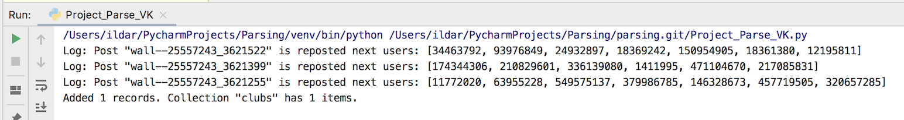
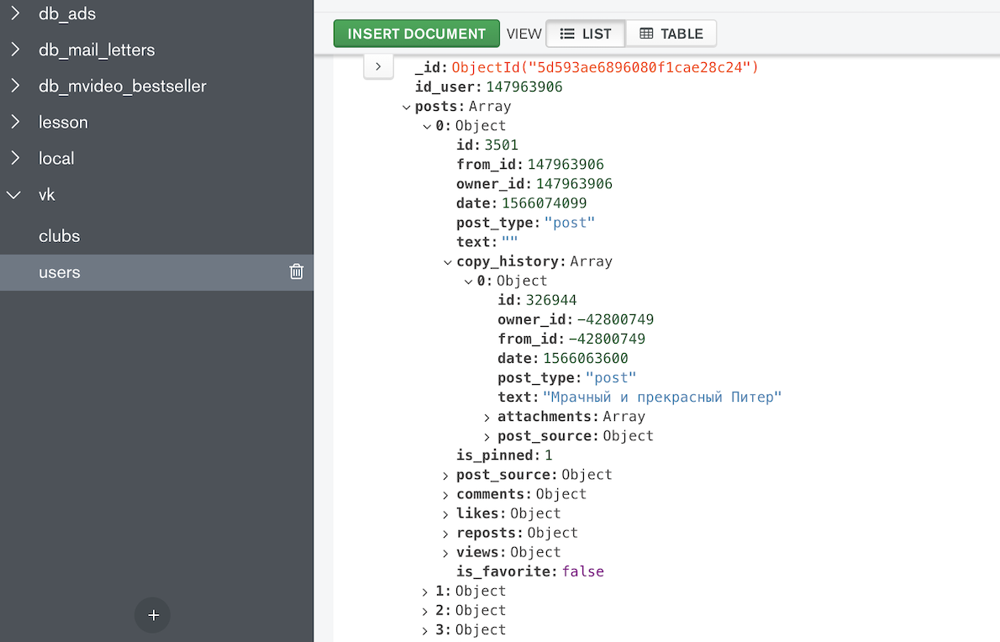
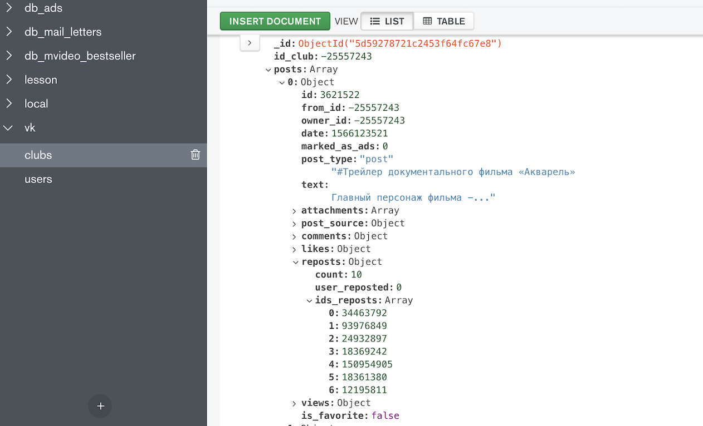

# BIG BRO

## Web crawler for parsing vk.com

### Stack:
* API: requests, API vk.com
* DataBase: MongoDB

### Task:
* Parse social net vk.com. Get information about posts who liked and reposted this.
* Code name: **BIG BRO**.
* Target: Social research. Research trends.
* Main project file: [Project_Parse_VK.py](https://github.com/hildar/parsing/blob/master/Project_Parse_VK.py)

### About

Web crawler scanning social net vk.com via API (for example one user's posts known as BadComedian) and parse people who has liked and reposted this one: 

Then save to MongoDB information about users:

And groups:

